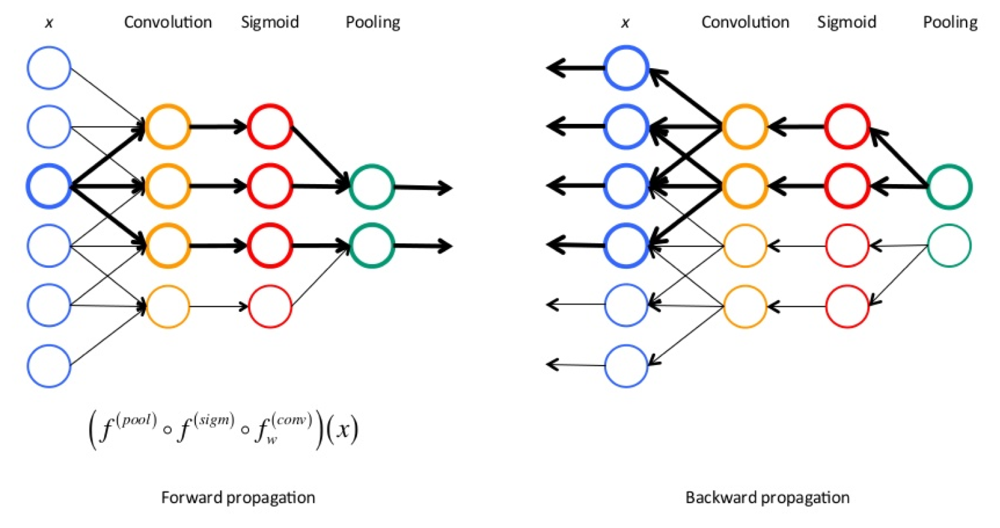

## 张量（Tensor）
**张量（Tensor）** 是一个数学概念，它是一个可以表示在多个向量、标量和其他张量之间的线性关系的多线性函数。

在机器学习和深度学习中，张量通常指的是一个**多维数组** ，**它是神经网络中数据的基本单位**。例如，一个 0 维张量是一个单独的数值（标量），一个 1 维张量是一个数组（向量），一个 2 维张量是一个矩阵，而更高维度的张量可以看作是**矩阵的推广**。

在 PyTorch 中张量在反向传播的时候可以**自动求偏导数**。

***

 

## 前向传播和反向传播

*两个过程在训练神经网络时会反复进行，直到模型的性能达到满意的水平。*

 

### 前向传播（Forward Propagation）
简单理解就是将上一层的输出作为下一层的输入，并计算下一层的输出，一直到运算到输出层为止。主要用于获取模型的预测输出和损失值。

**作用**：
- **计算预测值**：将输入数据通过神经网络的每一层传递，最终得到输出层的预测结果。

- **评估性能**：使用损失函数（如均方误差或交叉熵）来衡量预测值和真实值之间的差异，这个差异反映了模型当前的性能。

 

### 反向传播（Backward Propagation）

*~~实际上就是不停的导（链式法则）来计算梯度~~*

在前向传播过程中，数据通过网络层进行传递，最终得到**预测输出**和**损失值**。反向传播则是这个过程的**逆过程**，它从输出层开始，逆向通过网络，按照**链式法则**计算每一层的**参数梯度**。**这些梯度指示了如何调整参数以减少损失**。

步骤通常包括：

- **计算梯度**：对于网络中的每一层，计算损失函数关于该层权重的梯度。
- **更新参数**：根据计算出的梯度和学习率，更新网络的权重和偏置。

 

*资料：*
###### [【深度学习篇】：前向传播（forward）和反向传播（backward）](https://zhuanlan.zhihu.com/p/447113449)

---

 

## 梯度

**梯度**是一个多元函数在某一点上的导数向量，它指向函数在该点增长最快的方向。梯度的**方向**是函数值增加最快的方向，而梯度的 **大小（或模）** 表示函数在这个方向上的变化率。

数学上，如果有一个多元函数$$f(x_1, x_2, ..., x_n)$$，那么这个函数在某一点的梯度是由该点处对各个参数求偏导数得到的向量。用数学符号表示，梯度记作$$\nabla f$$或$$\text{grad} f$$
计算公式如下：

$$
\nabla f = \left( \frac{\partial f}{\partial x_1}, \frac{\partial f}{\partial x_2}, ..., \frac{\partial f}{\partial x_n} \right)
$$

---

 

## forward()
``forward()`` 在模型``nn.Module``类里定义的前向传播函数。``forward()`` 传入参数即可自动调用，``model(data)`` 等价于 ``model.forward(data)``（原理是调用了 ``__call__`` 函数）。

---

 

## torch.randn()
<code>randn(\*size)</code> **用于生成一个张量**，**该张量填充有从标准正态分布（均值为 0，标准差为 1）中抽取的随机数**。

这个函数**在神经网络的权重初始化中非常有用**，因为它可以帮助避免权重值过大或过小的情况。也可以用来**向数据中添加一些随机生成的噪声**。

具体来说，<code>torch.randn(\*size)</code> 的 size 参数定义了输出张量的形状。

例如，<code>torch.randn(2, 3)</code> 会生成一个 2x3 的张量，其元素都是从标准正态分布中随机抽取的。

***

 

## torch.utils.data.TensorDataset() 
<code>TensorDataset(data_tensor, target_tensor)</code>  **即创建包装数据和目标张量的数据集。**

- data_tensor：（Tensor），包含了样本的数据。
- target_tensor：（Tensor），包含了样本的目标（答案、标签）。

***
 

## torch.utils.data.DataLoader()
<code>DataLoader(dataset, batch_size=1, shuffle=False, sampler=None, num_workers=0, collate_fn=<function default_collate>, pin_memory=False, drop_last=False)</code>

- 参数：
    - dataset (Dataset) – 加载数据的数据集。
    - batch_size (int, optional) – 每个 batch 加载多少个样本(默认: 1)。
    - shuffle (bool, optional) – 设置为 True 时会在每个 epoch 重新打乱数据(默认: False)。
    - sampler (Sampler, optional) – 定义从数据集中提取样本的策略。如果指定，则忽略 shuffle 参数。
    - num_workers (int, optional) – 用多少个子进程加载数据。0 表示数据将在主进程中加载(默认: 0)
    - collate_fn (callable, optional) – ~~官网没写注解~~
    - pin_memory (bool, optional) – ~~官网没写注解~~
    - drop_last (bool, optional) – 如果数据集大小不能被 batch size 整除，则设置为 True 后可删除最后一个不完整的 batch。如果设为 False 并且数据集的大小不能被 batch size 整除，则最后一个 batch 将更小。(默认: False)

~~参数太多了看不懂，还是来看例子吧。~~

#### 例子：

1. <code>DataLoader(dataset, batch_size=10, shuffle=True)</code>，即对 TensorDataset
生成的数据集 dataset 进行加载:
    - <code>batch_size</code>: 

        - 批量加载：<code>batch_size=10</code> 指定了每个批次加载的样本数量。在这个例子中，每次迭代将返回 10 个样本的数据和标签。
    - <code>shuffle</code>:

        - 洗牌：<code>shuffle=True</code> 表示在每个 epoch 开始时，数据将被打乱。这有助于模型学习时的泛化能力，因为它确保了模型不会记住批次中样本的顺序。
 
2.
    - [ ] 后续补充更多例子

***

 

